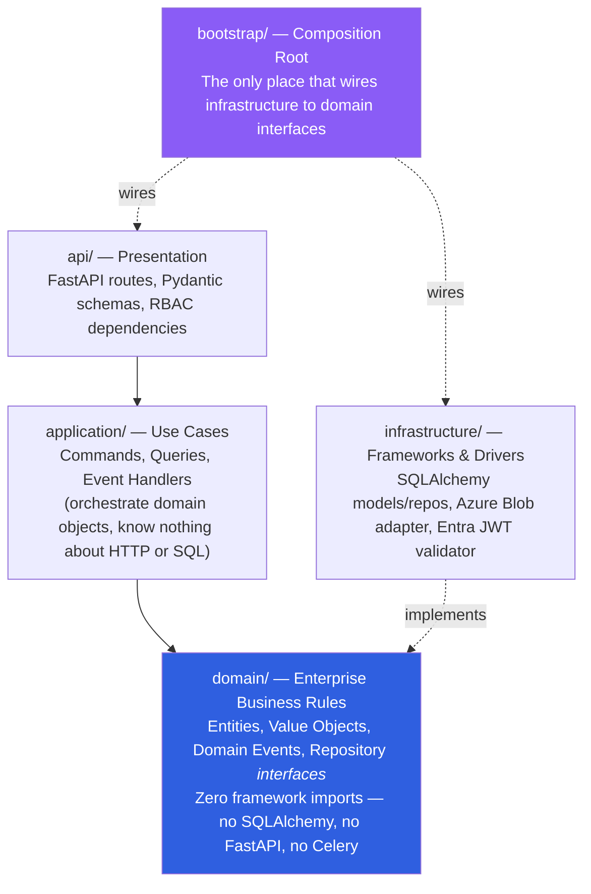
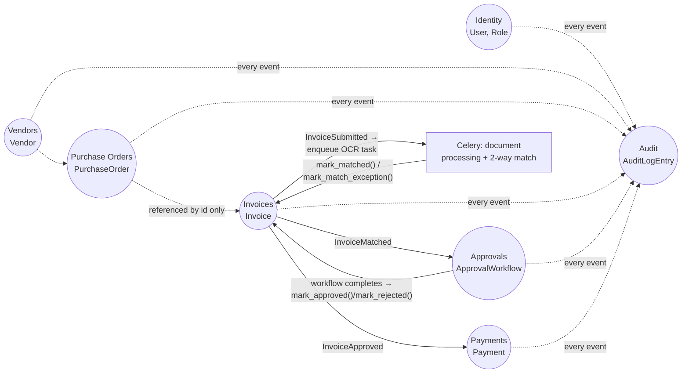
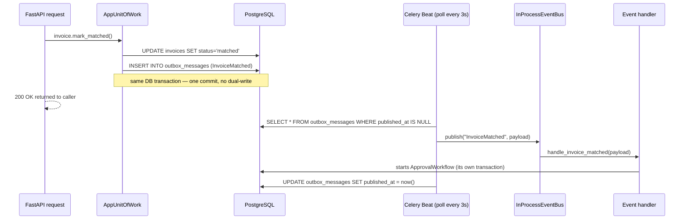
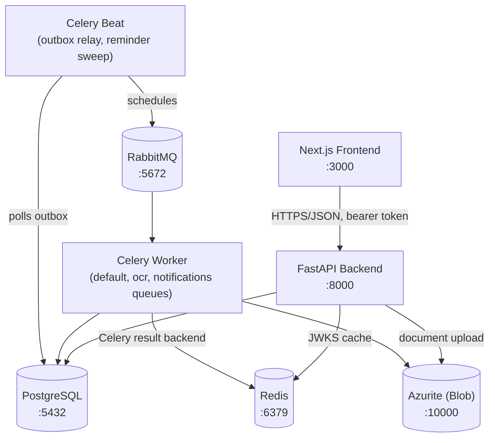

# Architecture

## Layering: Clean Architecture

Every bounded context (`backend/app/<context>/`) is sliced into the same four layers, with dependencies pointing inward only:

**Dependency Inversion in practice**: `application/` depends on repository *interfaces* declared in `domain/` (e.g. `IVendorRepository`) and on narrow `Protocol`s declared in `application/ports.py` (e.g. `VendorsUnitOfWork`, which only requires a `.vendors` property + `commit()`/`rollback()` — not the full concrete `AppUnitOfWork`). `infrastructure/repository_impl.py` implements those interfaces against SQLAlchemy. `bootstrap/container.py` and `bootstrap/unit_of_work.py` are the only modules allowed to know about every context and wire the concrete pieces together — this is enforced by convention and reviewed in `mypy app` (zero errors across 221 files), not by a runtime boundary.

## Domain-Driven Design: bounded contexts

Seven bounded contexts, each with its own aggregates, ubiquitous language, and (mostly) its own value objects — see `vendors/domain/value_objects.py` for the explicit note on why `EmailAddress`/`TaxId`/`Address` are deliberately duplicated per context rather than shared, versus `Money` and `Role`, which *are* treated as a genuine Shared Kernel because 2-way matching and RBAC need them numerically/structurally identical everywhere.

Aggregate boundaries follow Evans' rule of thumb — small, and consistent *within* a transaction, eventually consistent *across* aggregates:

- **`Vendor`**, **`PurchaseOrder`**, **`Invoice`**, **`ApprovalWorkflow`**, **`Payment`** are each their own aggregate root. `Invoice`/`PurchaseOrder` line items are modeled as **value objects** stored as a JSONB array on the parent row (no independent lifecycle, wholesale replaced on edit) — see `purchase_orders/domain/value_objects.py`. `ApprovalStep`, by contrast, is a **child entity** with its own table (`approval_steps`), because each step genuinely has an independent lifecycle (pending → approved/rejected, by whom, when) that the parent `ApprovalWorkflow` needs to query on directly.
- `Invoice` references `PurchaseOrder` and `Vendor` **only by id** — never loads or mutates them. `ApprovalWorkflow` is deliberately a separate aggregate from `Invoice` (not embedded), so an approver acting on a step doesn't lock/version the whole invoice row.
- `AuditLogEntry` is a plain, immutable, append-only record — not a full `AggregateRoot` — because it has no invariants to protect and never raises further events (which would risk infinite audit-of-audit recursion through the outbox).

## Cross-aggregate consistency: the transactional outbox

Domain events never trigger side effects synchronously in-process. Every cross-aggregate/cross-context reaction goes through the same durable path:

- `AggregateRoot._record_event(...)` (`shared/domain/aggregate_root.py`) collects events in memory; nothing is written until `SqlAlchemyUnitOfWork.commit()` (`shared/infrastructure/db/unit_of_work.py`) flushes them to `outbox_messages` in the *same* transaction as the state change.
- `workers/tasks/outbox_relay_task.py` (Celery Beat, every `OUTBOX_RELAY_POLL_SECONDS`) polls unpublished rows and dispatches them to `InProcessEventBus`. Delivery is **at-least-once** — handlers must be idempotent (most check current aggregate state before acting, which is naturally idempotent for a state-machine transition).
- `bootstrap/event_handlers.py` is the registry: `InvoiceSubmitted → enqueue OCR task`, `InvoiceMatched → start approval workflow`, `InvoiceApproved → schedule payment`, and a **wildcard subscription** (`event_bus.subscribe_to_all`) that feeds the audit trail from every event type without enumerating them.
- Two use cases (`StartApprovalWorkflowUseCase`, `ApproveStepUseCase`/`RejectStepUseCase`) update *two* aggregates (the workflow and the invoice) in one DB transaction — a deliberate exception to "one aggregate per transaction," justified in each module's docstring: it's a single reaction to one event, both aggregates live in the same database, and one atomic commit is safer than a second outbox hop that could leave the invoice stuck mid-flight if the process died in between.

## Threshold-based approval chain

`approvals/domain/services.py:ApprovalChainBuilder` turns an invoice total into a role sequence:

| Invoice total | Steps |
|---|---|
| ≤ `APPROVAL_THRESHOLD_L1_MAX` (default $1,000) | `APPROVER` |
| ≤ `APPROVAL_THRESHOLD_L2_MAX` (default $10,000) | `APPROVER` → `FINANCE_ADMIN` |
| above that | `APPROVER` → `FINANCE_ADMIN` → `FINANCE_ADMIN` (a second, independent Finance Admin) |

`ApprovalWorkflow` enforces sequential decisions (a step can't be acted on until every prior step is approved) and forbids the same user deciding two steps in one workflow — so the "dual Finance Admin" tier genuinely requires two different people.

## Auth: FastAPI as an OAuth2 resource server

The Next.js frontend does the interactive Entra ID login (via MSAL.js); **FastAPI never handles a redirect flow** — it only validates a bearer JWT against Entra's JWKS (`identity/infrastructure/entra/jwt_validator.py`, JWKS cached in Redis). `get_current_user` JIT-provisions a local `User` row keyed by the Entra `oid` claim on first login; role is sourced from that local table (assigned via `/users/{id}/role`, Finance-Admin-gated), not from Entra App Roles — this avoids needing tenant-admin consent for local dev (Phase 2 item: sync from Entra App Roles).

A `dev.<base64url-json>` token format, gated behind `AUTH_DEV_MODE` (which the `Settings` model refuses to enable outside `APP_ENV=local`), lets the whole platform run end-to-end without a real Entra tenant — see `docs/api/README.md`.

RBAC is checked twice: at the API boundary (`identity/api/dependencies.py:require_role`) and again inside domain methods that are also reachable from non-HTTP callers, e.g. `ApprovalWorkflow._guard_can_decide` re-validates the actor's role even though a Celery task or test could otherwise call it directly.

## System components

## Cross-cutting concerns

- **Exceptions**: a single `DomainException` hierarchy (`shared/domain/exceptions.py`: `NotFound` / `Validation` / `Conflict` / `UnauthorizedDomainAction`) maps generically to RFC 7807 `problem+json` in `api/exception_handlers.py` — no router ever catches a domain exception itself.
- **Retries**: `tenacity`-wrapped exponential backoff on the two adapters that talk to real external services — `AzureBlobStorageAdapter` and `CeleryTaskQueueAdapter` (`shared/infrastructure/`).
- **Rate limiting**: every write endpoint (`POST`/`PATCH`) carries `@limiter.limit(settings.rate_limit_write)` (slowapi); reads fall back to a looser default.
- **Logging & tracing**: `structlog` JSON logging configured identically in the API process (`bootstrap/app_factory.py`) and each Celery worker process (`workers/celery_app.py`, via the `worker_process_init` signal); a `CorrelationIdMiddleware` binds a per-request id into every log line. OpenTelemetry is wired with a console exporter for local visibility (Phase 2: OTLP → Prometheus/Grafana).
- **Validation**: Pydantic v2 schemas at the API boundary; domain-level invariants (e.g. "can't activate a vendor without a W-9") are enforced again in the domain layer regardless of what the API validated, so they hold for every caller.

## Testing strategy

- **Unit** (`backend/tests/unit/`, 70 tests): pure domain/application logic — no database, no network. `tests/fakes/` provides in-memory repository and port implementations for the handful of tests that exercise a full use case (e.g. `test_invoice_submission_flow.py` running the real `submit → OCR → match` pipeline against fakes).
- **Integration** (`backend/tests/integration/`, 10 tests): the real FastAPI app + a real Postgres spun up via `testcontainers`, driven through actual HTTP calls — routing, RBAC, and the SQLAlchemy mapping layer all execute for real. Automatically skipped if Docker isn't reachable. The one deliberate simplification: the async Celery hop (document processing, workflow start, payment scheduling) is invoked as a direct function call in these tests rather than through a live broker + worker — standing up RabbitMQ + a worker process inside a test adds risk without adding coverage the unit tests don't already provide for that logic; see the module docstring in `test_invoice_submission_flow.py`.
